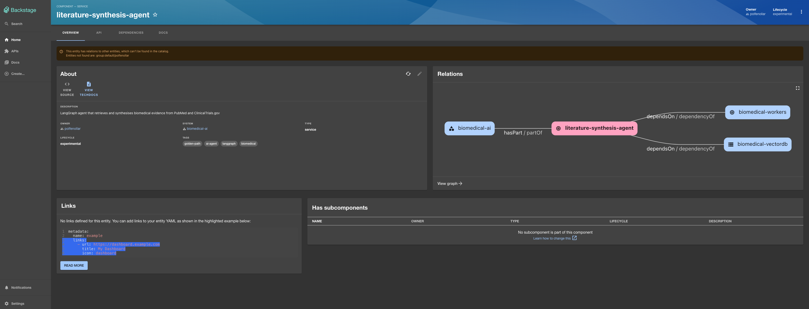
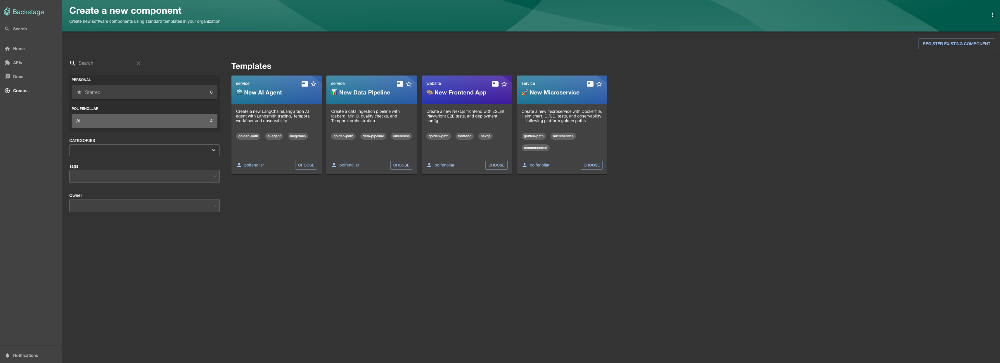

# Developer Portal — Platform Engineering Layer




**Unified platform engineering layer** managing the full code lifecycle (dev → staging → production) for two concurrent projects. Provides a [Backstage](https://backstage.io) service catalog, golden paths for AI developer agents, full CI/CD automation, GitOps deployments, and an end-to-end observability stack.

## Projects Under Management

| Project | Description | Stack | Repo |
|---|---|---|---|
| **Veyor Marketplace** | Freight SaaS connecting shippers with carriers | Next.js · Spring Boot · Go · Python | [Veyor-marketplace](https://github.com/polfenollar/Veyor-marketplace) |
| **BioMedical AI** | Evidence synthesis MLOps platform with multi-agent workflows | Python · LangGraph · Temporal | [evidence-based-biomedical-multiagent-ai](https://github.com/polfenollar/evidence-based-biomedical-multiagent-ai) |

Both repos are included as Git submodules under `projects/`.

---

## Platform Capabilities

| Category | Tools |
|---|---|
| **Developer Portal** | Backstage — service catalog, TechDocs, Scaffolder golden paths |
| **CI/CD** | GitHub Actions — 8 reusable workflows (test, build, deploy, lint, scan) |
| **Code Quality** | ESLint · Checkstyle · Ruff · golangci-lint |
| **Testing** | Unit · Integration · E2E (Playwright) · Load (k6) |
| **Security** | Semgrep · CodeQL · npm audit · pip-audit · Gradle dependency-check |
| **IaC** | Terraform (AWS free-tier) · Crossplane |
| **GitOps** | Argo CD (app-of-apps pattern) · Argo Workflows | SAST DAST scanning for vulnerablities 
| **Containers** | Docker · Kubernetes (kind local / k3s AWS) · Helm |
| **Service Mesh** | Istio — mTLS, traffic management, circuit breaking |
| **Observability** | OpenTelemetry · Prometheus · Loki · Grafana · Langsmith |
| **Feature Flags** | Flagsmith (self-hosted) |
| **AI Agent Guardrails** | Architecture docs + coding standards consumed by AI coding agents |

---

## Architecture Overview

```
┌─────────────────────────────────────────────────────────────────┐
│                        Developer Portal                         │
│                    Backstage (port 3000)                        │
│         Service Catalog · TechDocs · Scaffolder Templates       │
└──────────────────────────┬──────────────────────────────────────┘
                           │
         ┌─────────────────┼─────────────────┐
         ▼                 ▼                 ▼
  ┌─────────────┐  ┌──────────────┐  ┌──────────────────┐
  │  Veyor      │  │  BioMedical  │  │  Platform Layer  │
  │  Marketplace│  │  AI          │  │                  │
  │             │  │              │  │  Argo CD         │
  │  Next.js    │  │  FastAPI     │  │  OTel Collector  │
  │  Spring Boot│  │  Temporal    │  │  Prometheus      │
  │  Go (gRPC)  │  │  LangGraph   │  │  Grafana / Loki  │
  │  FastAPI    │  │  Qdrant      │  │  Flagsmith       │
  │  Kafka      │  │  MinIO       │  │  Istio           │
  └─────────────┘  └──────────────┘  └──────────────────┘
         │                 │
         └─────────────────┘
                  │
         Kubernetes (kind / k3s / EKS)
         Terraform · Crossplane · Helm
```

---

## Repository Structure

```
developer-portal/
├── backstage-app/                  # Backstage monorepo (portal frontend + backend)
│   ├── packages/app/               # React frontend
│   ├── packages/backend/           # Node.js backend
│   └── app-config.yaml             # Backstage configuration
├── backstage/
│   └── catalog/                    # Backstage catalog entity definitions
│       ├── veyor-catalog.yml
│       └── biomedical-catalog.yml
├── platform/
│   ├── github-actions/             # Reusable CI/CD workflow definitions
│   │   ├── test-unit.yml           # Unit tests (TS, Java, Python, Go)
│   │   ├── test-integration.yml    # Integration tests
│   │   ├── test-e2e.yml            # Playwright E2E tests
│   │   ├── test-load.yml           # k6 load tests
│   │   ├── build-docker.yml        # Multi-service Docker build matrix
│   │   ├── deploy.yml              # Helm deploy to dev / staging / prod
│   │   ├── lint.yml                # All linters
│   │   └── sast-scan.yml           # Semgrep + CodeQL
│   ├── kubernetes/
│   │   ├── base/                   # Namespaces, network policies, resource quotas
│   │   ├── charts/                 # Helm charts (6 services)
│   │   ├── docker/                 # Dockerfiles (6 services)
│   │   └── kind-config.yml         # Local cluster configuration
│   ├── argocd/                     # GitOps app-of-apps manifests
│   ├── argo-workflows/             # Argo Workflows CI/CD templates
│   ├── terraform/                  # AWS IaC modules (networking, compute, DB, storage, k3s)
│   ├── crossplane/                 # Cloud resource XRDs and compositions
│   ├── observability/              # OTel collector, Prometheus, Loki, Grafana, Langsmith
│   ├── service-mesh/               # Istio profiles and traffic policies
│   └── feature-flags/              # Flagsmith deployment
├── golden-paths/
│   ├── templates/                  # Backstage Scaffolder templates
│   └── agent-guardrails/           # Architecture + coding standards for AI agents
│       ├── AGENT_INSTRUCTIONS.md
│       ├── ARCHITECTURE_VEYOR.md
│       ├── ARCHITECTURE_BIOMEDICAL.md
│       ├── CODING_STANDARDS.md
│       ├── TESTING_STRATEGY.md
│       ├── SECURITY_GUARDRAILS.md
│       ├── INFRASTRUCTURE_GUARDRAILS.md
│       └── PR_CHECKLIST.md
├── projects/
│   ├── veyor-marketplace/          # Git submodule
│   └── biomedical-ai/              # Git submodule
├── Makefile                        # Central command hub (47 targets)
└── .env.example                    # Required secrets template
```

---

## Services Catalog

### Veyor Marketplace

| Component | Tech | Port | Description |
|---|---|---|---|
| veyor-frontend | Next.js 14, TypeScript | 3000 | Marketplace UI (App Router) |
| veyor-backend | Spring Boot 3, Java 21 | 8080 | Core API — identity, booking, shipments, notifications |
| veyor-quoting | Go, gRPC | 50051 | Real-time freight quote computation |
| veyor-agents | FastAPI, LangChain | 8000 | AI-powered customer support agent |
| veyor-carrier-simulator | Go, REST | 8081 | Event-driven carrier simulation |

**Data resources:** PostgreSQL · Redis · Kafka

### BioMedical AI

| Component | Tech | Description |
|---|---|---|
| biomedical-api | FastAPI, Python | Evidence queries and synthesis REST API |
| biomedical-workers | Temporal, LangGraph, Python | Data ingestion, embedding, agent orchestration |
| literature-synthesis-agent | LangGraph, Python | Multi-agent PubMed/ClinicalTrials evidence retrieval |

**Data resources:** PostgreSQL · MinIO · Qdrant · Temporal

---

## Quick Start

### Prerequisites

- Docker
- [kind](https://kind.sigs.k8s.io/) (local Kubernetes)
- [kubectl](https://kubernetes.io/docs/tasks/tools/)
- [Helm](https://helm.sh/)
- Node.js 22+ and Yarn
- [Terraform](https://www.terraform.io/) (for AWS deployments)

### Local Development

```bash
# 1. Clone with submodules
git clone --recurse-submodules https://github.com/polfenollar/developer-portal.git
cd developer-portal

# 2. Copy and fill environment variables
cp .env.example .env

# 3. Start local Kubernetes cluster (kind)
make cluster-up

# 4. Deploy observability stack (Prometheus, Grafana, Loki, OTel)
make observability-up

# 5. Install Argo CD and sync applications
make argocd-install
make argocd-apps

# 6. Deploy all services to local cluster
make deploy-dev

# 7. Start Backstage portal
make backstage-dev

# 8. Open the portal
open http://localhost:3000
```

### Run Tests

```bash
make test-unit          # Unit tests (TypeScript, Java, Python, Go)
make test-integration   # Integration tests
make test-e2e           # Playwright end-to-end tests
make test-load          # k6 load tests
make lint               # All linters
make scan               # SAST + dependency security scans
```

### Deploy to Staging / Production

```bash
make deploy-staging     # Deploy to AWS k3s staging cluster
make deploy-prod        # Deploy to production (requires approval)
```

---

## CI/CD Pipeline

Every pull request runs automatically:

```
PR opened
    │
    ├── lint          ESLint · Checkstyle · Ruff · golangci-lint
    ├── test-unit     Jest · JUnit · pytest · Go test
    ├── test-integration
    ├── sast-scan     Semgrep · CodeQL · dependency audits
    └── build-docker  Multi-service image matrix build
              │
              └── (merge to main)
                        │
                        └── deploy → dev → staging → prod (gated)
```

All workflows are defined as reusable GitHub Actions in `platform/github-actions/` and called from each project's `.github/workflows/`.

---

## GitOps with Argo CD

Deployments to Kubernetes are fully GitOps-driven:

- The `platform/argocd/app-of-apps.yml` root application watches the `main` branch
- Any merged change to a Helm chart or manifest automatically triggers a sync
- Environments are isolated by namespace: `dev`, `staging`, `production`, `observability`, `platform`, `argocd`

```bash
make argocd-install    # Bootstrap Argo CD into the cluster
make argocd-apps       # Apply app-of-apps manifest
# Argo CD UI available at http://localhost:30080
```

---

## Observability

The full observability stack is deployed as Kubernetes manifests:

| Tool | Purpose | Port |
|---|---|---|
| OpenTelemetry Collector | Receives traces/metrics/logs from all services | 4317 (gRPC), 4318 (HTTP) |
| Prometheus | Metrics scraping and storage | 9090 |
| Loki | Log aggregation | 3100 |
| Grafana | Dashboards and alerting | 30030 |
| Langsmith | LLM trace observability | cloud |

All services emit traces via OTLP. Grafana dashboards are pre-configured for each service.

---

## Feature Flags

[Flagsmith](https://flagsmith.com) is self-hosted on Kubernetes alongside a dedicated PostgreSQL instance. Services read flags via the Flagsmith SDK using the `FLAGSMITH_ENVIRONMENT_KEY` environment variable.

---

## AI Agent Guardrails

The `golden-paths/agent-guardrails/` directory contains markdown documents consumed directly by AI coding agents (Claude, Cursor, etc.) as context. They define:

- **AGENT_INSTRUCTIONS.md** — Mandatory 11-step workflow every agent must follow before opening a PR
- **ARCHITECTURE_VEYOR.md** — Module boundaries, service contracts, event schemas
- **ARCHITECTURE_BIOMEDICAL.md** — Data flow, agent patterns, lakehouse design
- **CODING_STANDARDS.md** — Language-specific conventions (TypeScript, Java, Go, Python)
- **TESTING_STRATEGY.md** — Testing pyramid and coverage requirements per service
- **SECURITY_GUARDRAILS.md** — OWASP top-10 rules, secret management, scanning requirements
- **INFRASTRUCTURE_GUARDRAILS.md** — Kubernetes namespace strategy, Terraform module rules
- **PR_CHECKLIST.md** — Pre-merge validation checklist

---

## Infrastructure as Code

### Local (kind)

```bash
make cluster-up        # 3-node kind cluster (control-plane + 2 workers)
make docker-load       # Build and load all Docker images into kind
```

### AWS (Terraform)

Terraform modules under `platform/terraform/modules/`:

| Module | Description |
|---|---|
| `networking` | VPC, subnets, security groups |
| `compute` | EC2 instances |
| `database` | RDS / Aurora |
| `storage` | S3, DynamoDB |
| `k3s-cluster` | Lightweight Kubernetes on EC2 |

```bash
make tf-init     # terraform init
make tf-plan     # terraform plan
make tf-apply    # terraform apply
```

All modules target the AWS free tier.

---

## Environment Variables

Copy `.env.example` to `.env` and populate:

| Variable | Purpose |
|---|---|
| `GITHUB_TOKEN` | GitHub API integration for Backstage |
| `LANGCHAIN_API_KEY` | Langsmith LLM observability |
| `LANGCHAIN_PROJECT` | Langsmith project name |
| `AWS_ACCESS_KEY_ID` | AWS infrastructure access |
| `AWS_SECRET_ACCESS_KEY` | AWS infrastructure secret |
| `AWS_REGION` | AWS deployment region |
| `FLAGSMITH_ENVIRONMENT_KEY` | Feature flag SDK key |
| `GRAFANA_ADMIN_PASSWORD` | Grafana admin login |

---

## Make Targets Reference

```bash
# Cluster
make cluster-up             # Create local kind cluster
make cluster-down           # Delete local kind cluster
make cluster-status         # Check cluster health

# Backstage
make backstage-dev          # Start Backstage in dev mode (Yarn)
make backstage-build        # Production build

# Deploy
make deploy-dev             # Deploy all services to kind
make deploy-staging         # Deploy to AWS k3s staging cluster
make deploy-prod            # Deploy to production

# Code quality
make lint                   # Run all linters
make test                   # Unit + integration tests
make test-unit              # Unit tests only
make test-integration       # Integration tests only
make test-e2e               # Playwright E2E tests
make test-load              # k6 load tests
make scan                   # SAST + dependency security scans

# Docker
make docker-build           # Build all service images
make docker-load            # Build + load images into kind

# Infrastructure
make tf-init                # Terraform init
make tf-plan                # Terraform plan
make tf-apply               # Terraform apply
make argocd-install         # Install Argo CD
make argocd-apps            # Apply app-of-apps
make argo-workflows-install # Install Argo Workflows
make observability-up       # Deploy full observability stack
```

---

## License

MIT License — Copyright (c) 2026 Pol Fenollar Villà
